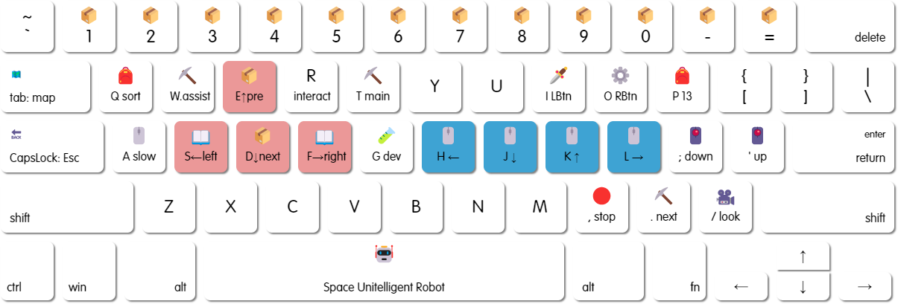

# MyTimeAtPortiaKeymap

Replace mouse operation, Simply repeat action.

One key does more than one thing.



## Requirements

- OS : Windows 7 / 10 / 11
- Autohotkey : H-2.0-beta.3 ( @ [thqby/AutoHotkey_H](https://github.com/thqby/AutoHotkey_H.git) )
- My Time At Portia : final 2.0.141541 ( last updated time : 2021 / 08 )
- Game Resolution : `1680 * 1050` ( only )

## Install

1. download `.zip` package from lastest [Releases](https://github.com/miozus/MyTimeAtPortiaKeymap/releases/latest) and unzip . Or

```bash
git clone https://github.com/miozus/MyTimeAtPortiaKeymap.git
```

2. open `Portia.ahk` with Notepad or Visual Studio Code, change setting as you like ( or use default setting of mine directly and skip this step )
   - GameSetting : write down what you set in game.
   - Keymap : `yourHotkey::function()` , you can define new function in `PortiaFuntions.ahk`
3. Setting In Game :
   - [ ] Setting Reference [Screenshot](docs/img/GameSettingReference.png)
   - [x] Resolution must be `1680 * 1050` at window mode.
   - [x] `Lens inertia` must be checked, for move mouse with fluent perfomance.
4. open `Portia.ahk` with Autohotkey.exe ( win32 or x64w ) , run with **Administrator privilige** if hotkey not works in game. ( usually, normal privilige is OK ).
5. play game ( the order of launcher does not matter ).

## Usage

### 🖱️ Game Mouse

Mouse, control perspective. yes, it's vim style:

|              |    Camera    |              |
| :----------: | :----------: | :----------- |
|              | <kbd>K</kbd> |
| <kbd>H</kbd> | <kbd>J</kbd> | <kbd>L</kbd> |

| From | <kbd>I</kbd> | <kbd>O</kbd> | <kbd>;</kbd> | <kbd>'</kbd> |
| :--: | :----------: | :----------: | :----------: | :----------: |
|  To  |  LeftButton  | RightButton  | Scroll down  |  Scroll up   |

<kbd>A</kbd> : Hold on While press mouse hotkey, to slow down mouse move speed, it performance well on bag UI.

<kbd>/</kbd> : Resize actor's perspective to focus on forehead.

### 🏃‍♀️ Hero Direction

At Oustside, actor move 4 directions ( up, down, left, right ):

|              |     Run      |              |
| :----------: | :----------: | :----------: |
|              | <kbd>E</kbd> |              |
| <kbd>S</kbd> | <kbd>D</kbd> | <kbd>F</kbd> |

But if you open staic UI, when actor cant move, the directions becomes another keymap set:

|        | <kbd>S</kbd> | <kbd>F</kbd> |                 Tips                  |
| :----: | :----------: | :----------: | :-----------------------------------: |
| PageUI |     left     |    right     | click left / right button to tun page |

( PageUI : except BagUI case of poverty to release all grids. )

|    Hotkey    |  action  |          Tips           |
| :----------: | :------: | :---------------------: |
| <kbd>E</kbd> | previous | click previous Bag Item |
| <kbd>D</kbd> |   next   |   click next Bag Item   |

If there is CounterUI, those actions priority is highest:

|    Modifier     | <kbd>S</kbd> | <kbd>F</kbd> |     Tips     |
| :-------------: | :----------: | :----------: | :----------: |
|                 |    minus     |     plus     |    click     |
| <kbd>Ctrl</kbd> |     min      |     max      |    click     |
| <kbd>Alt</kbd>  |    center    |    center    | input number |

### ⛏️ Work State

Each state has two skills, they aim to do one work together.

| State |  Name  |   <kbd>T</kbd> Main    | <kbd>W</kbd> Assist |                                          Tips                                          |
| :---: | :----: | :--------------------: | :-----------------: | :------------------------------------------------------------------------------------: |
|   🛖   | Hoster | conitnueWorkingProduct |   startMaxProduct   |                                      **Default**                                       |
|  🐟   | Fisher |        fish +5         |      fish -10       |                              number 1~5 ⇒ feed n\*35 rice                              |
|  ⛏️   | Farmer |    LButtonClickLoop    |  seekingTreasures   | press <kbd>,</kbd> to stop loop, Eletic Drill prefer to use mouse or hold <kbd>I</kbd> |

<kbd>.</kbd> : Turn to next state for cycle.

### 📦 Item Selector

When different UI appears, hotkey presents suitably itself.

Default ( Outside )

<kbd>1</kbd> ~ <kbd>P</kbd> : No mapping, remain origin key.

ManualUI

| Hotkey                      | Maping Position | Tips         |
| :-------------------------- | :-------------- | :----------- |
| <kbd>1</kbd> ~ <kbd>3</kbd> | [1, 1-3]        | N's Tab      |
| <kbd>4</kbd> <kbd>5</kbd>   | [left, right]   | start makeup |

BagUI

| Hotkey                                              | Maping Position | Tips                                  |
| :-------------------------------------------------- | :-------------- | :------------------------------------ |
| <kbd>1</kbd> ~ <kbd>8</kbd>                         | [1-8, 1]        | 1st row                               |
| <kbd>9</kbd> <kbd>0</kbd> <kbd>-</kbd> <kbd>=</kbd> | [1-8, 2-5]      | the 2 ~ 5 row, like climb down ladder |
| <kbd>P</kbd>                                        | [1-8, P]        | equipment bar                         |

<kbd>Q</kbd> : Quick Sort Bag and Box's Items, and hover on the center fo Box.

ListUI

| Hotkey                      | Maping Position | Bioler Station | Relic  | FeedAnimal | Cook Menu |
| :-------------------------- | :-------------- | :------------- | :----- | :--------- | :-------- |
| <kbd>1</kbd> ~ <kbd>7</kbd> | [1, 1-7]        | N's product    | stages | food       | menu      |

Specially, when you hold on modifier key above all, it follows secondary action.

| Modifier        | Hotkey                      | Maping Position | Tips                                     |
| :-------------- | :-------------------------- | :-------------- | :--------------------------------------- |
| <kbd>Ctrl</kbd> | <kbd>1</kbd> ~ <kbd>P</kbd> | [1-8, N]        | And Press Exchange ( to bag )            |
| <kbd>Alt</kbd>  | <kbd>1</kbd> ~ <kbd>P</kbd> | [1-8, N]        | And Press RightButton ( to box / actor ) |

### 🤖 Unitelligent Robot

> "Perhaps I knows what you do next."

If you stay outside, farm or ride aircraft, it keep silent as origin key.

It appears at those scene:

- Accept the Chamber of Commerce Daily Quest
- Feed Animal
- Read Email
- Arrange food and wait for alpaca
- Dialog choose option 1
- Start challenge remains
- Lead you go home by bus

It feels upset sometimes, keep patient please.

### 🧪 Develop Tool

Now you have the ability to copy code from clipboard, which can recognise the game scene, and define your new function.

|             Combine              |             <kbd>G</kbd>             |                      Tips                       |
| :------------------------------: | :----------------------------------: | :---------------------------------------------: |
|         <kbd>Ctrl</kbd>          |           which scene now            | detech every collected scene and register state |
|          <kbd>Alt</kbd>          |       pixelsearch under cursor       |                 get copied code                 |
|  <kbd>Ctrl</kbd> <kbd>Alt</kbd>  |          click under cursor          |                 get copied code                 |
| <kbd>Ctrl</kbd> <kbd>Shift</kbd> | convert counterUI position to string |                 get copied code                 |
|             ( null )             |             <kbd>G</kbd>             |                press origin key                 |

Design notes will be release soon.

Game demo video cutted completed, is making icon description or words.

## Contributing

All by myself, welcome to PR.

## License

MIT © Copyright (c) 2021 miozus
