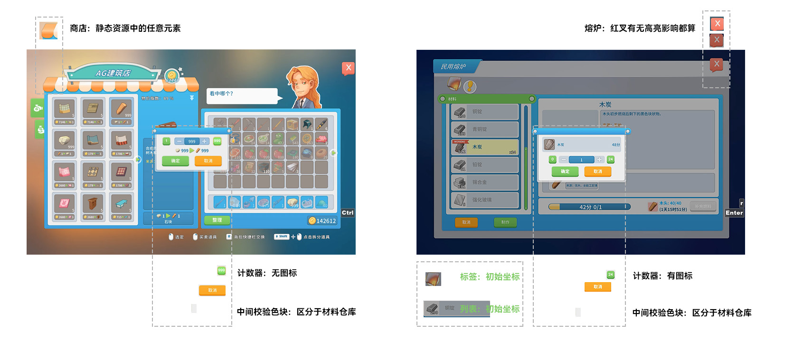
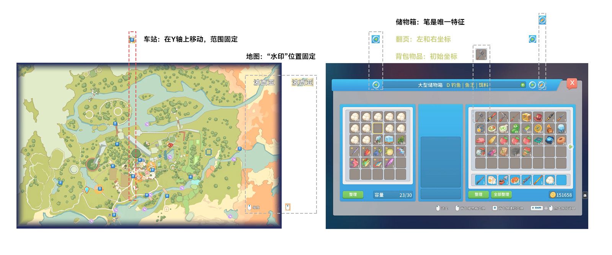

# 设计笔记

执行数字键的责任链

## ⌨️ 物理按键

在设计上，默认打字标准指法，让快捷键集中在双手自然放下的地方，尽量减少手指的位移，和按键次数。

因为传统的方向键 <kbd>W</kbd> <kbd>S</kbd> <kbd>A</kbd> <kbd>D</kbd>，食指不好跨一个键位按到 <kbd>G</kbd>。所以整体右移一位， <kbd>E</kbd> <kbd>S</kbd> <kbd>D</kbd> <kbd>F</kbd> ，扩大小指的按键范围。

实际开发中，方向键和功能键很难融合在一起，因为 AHK 只支持单线程，不能实现两个按键同时共享一个函数方法，虽然勉强通过拼接缓存区字符串表示一起按下多个键，但人物行动效果卡得像 PPT，而挂起（假死）方向键，反而成了最优解。

## ⛏️ 形态

提炼每个场景最常用的功能，塞进 2 个按键 <kbd>T</kbd> <kbd>W</kbd>。形态可以自由切换，每个形态只做一件事。这里参考了 VIM 的模式哲学。

这是后期归纳的抽象层，在责任链中，我提了非常高的权限。有多高？高到可以把脚本挂起（假死），阻塞方向键拓展的功能，就像未运行脚本一样。

## 🚀 快捷键

因为观察到，交换背包物品，由两个动作组合完成。

1. 点击物品
2. 点击功能键（鼠标右键或交换键）

数字键和功能键距离远时，还要找半天。所以干脆 `后置转前置`，用键盘左下角的 <kbd>Ctrl</kbd> / <kbd>Alt</kbd> 键修饰 ，然后具体实现中，附加后置动作。

而计数器的按钮，一行对称的五个按钮，按下 <kbd>S</kbd> / <kbd>F</kbd> 键，点到加减号，我用 <kbd>Ctrl</kbd> 修饰，表示“在旁边”。<kbd>Alt</kbd> 修饰，表示“在中间”。

其他控件，没有这层策略。

## 🏕️ 场景路由

场景是脚本最基本的单位，由 N 个像素特征组成，像素特征离开场景来讨论是没有意义的，它们存在的意义是，切割了游戏世界中的空间。具体来看，它是 UI、框架、模板和控件元素等静态资源，视觉上遵循对齐排版，类型统一，用来解释物品，强调物品差别，引导角色动机的形成。

场景的抽象，带来一个有趣的语言现象。由于一个控件（如右上角红叉的特征）可以代表工作台、熔炉、搅拌器等场景，本质都是散列的特征像素点，但概念上拓展了"场景"的含义——任意一个控件，“它是搅拌器”，等同于“我处在搅拌器的交互界面中”。实际上，我们可能看到的是，“我们正在工作台制作物品”——脚本让我们获得了操作同类控件的能力，殊途同归。

识别场景是所有操作的根基，执行我们的期待的操作指令才是目的。我们需要某个功能的时候，才会去识别场景，否则让按键保持原来的含义。

对游戏场景类型的起名，遵循 HTML 元素组件风格，如列表、标签。

1. 怎么让脚本知道，现在身处什么场景？

   取色。

   视觉永远是通用的语言。实际上，在游戏世界中，我们无法操作我们看不见的东西。

   这是所有自动化脚本语言，Python，Lua，AutoHotkey，按键精灵等的基础设施，当我们没能获取底层接口时。

   实际运用中，AutoHokey 的识图功能非常拉跨 。同一张小图，第一次识别到，过一会就识别失败了，参考文档调整参数或者重新截图，截两三图，都失败了。但好在取色功能能用，从按下按键到报告查找到目标，用时约 200ms。

1. 怎么提高识别的成功率和准确率？

   每个场景（控件，元素）都有独一无二的颜色特征。

   识别特征，从本质上看，是一个区分自我和他者的问题，是一个逐渐积累证据的过程。

   取色识别行为，是矩形框范围内逐行扫描像素 RGB 数值，与目标颜色数值进行大小比较的过程。

   场景特征有以下性质：

   1. 唯一性。特征像素点可能不止一个，但它或它的组合，在场景集合中是唯一的。

      最简单的情况: 一个微小的像素点，就代表了整个场景。它可能在所有游戏场景中有兄弟，但我们只关心需要执行某种操作的场景，按键功能，也只会从记录在案的场景集合中查找。

      如果这个特征，在两个场景出现重叠，那先考虑具体实现的功能是否冲突，如冲突，再拓展其中一个场景的识别特征，或者抛弃它，重新找唯一的像素点。

      以此类推。

      在实际用中，我识别一个场景的特征像素点，最多三个。

   1. 静止性。无论鼠标和键盘怎么操作，颜色和坐标都不会变化。

      - 悬浮高亮：游戏中为了突出“强调”的视觉效果，鼠标悬浮到 UI 控件上时，控件会提高颜色的亮度。为了避免高亮导致丢失特征的影响，其实除了避开它或者扩大颜色判定阈值，我们还可以选择它失效时，其他同场景的其他特征作辅助验证，或者它高亮时的样式继续作为特征，也可以让寄存器储存状态信息，表示“我还在这里”，在场景进出口做状态的记录或清除。

      - 相似偏移：同个控件在不同场景出现，只是位置偏移了一下。那么新建一个函数，颜色不变，只改坐标就行。

      - 找到不变量：在运动中找到相对静止的东西。比如，车站地图场景：全图可能上下滚动，但不能左右滚动，找到不变的元素 `波西亚` `🖱️ 缩放` 字样。又如，车站地图场景中的家园站台：地图宽度被锁定，只能上下拖拽，这使得每个站台的 X 坐标都不一样，而且每条 Y 轴的颜色差异是唯一的，明显的，所以可以锁定区间。

   1. 动态性。人的操作会改变它的状态，出现或消失。

      有些场景加载响，延迟可能长达 1500 毫秒。比如民兵团人物委托中的计数器弹窗，点击最大化太快，会点击失败。

1. 场景特征超过三个或太多，坐标多又重复计算，运行变慢，怎么办？

   为了代码可读性，我把相似控件分门别类起函数名。有时查一个场景会把同类都查了一遍。

   因为考虑到，停留在交互界面思考和做选择的时间，比较久。我增加了缓存机制，第一次会遍历查询并储存状态，第二次先读取状态，“还在这里”，就放行，读不到再查询。

   计数器，动态计算时（关闭缓存）时，我在嵌套对象的数据结构中，设计了字段 `lock`，实现“只能写 1 次，但可以读 N 次”的读写锁。只计算和储存 1 次。重载脚本可以解锁（重新实例化对象）。

## 🐘 抽象

刚开始写几行代码，一键操作锅炉继续生产的指令，根本不管什么场景，执行无差别的动作。整个脚本都是语境上下文。

随着代码越写越多，开始用面向对象的的视角审视问题，将游戏中的控件，抽象成相同的列表，手册，翻页，游戏鼠标，形态，游戏场景等对象，专门处理控件偏移量和代码复用问题。

同类控件，只要改下初始坐标，就能算出控件中其他坐标。

面对新的界面，只需添加游戏中的“旧功能”，用手写的取色工具，复制粘贴，几分钟搞定。

责任链设计模式 ： HotKey ⇒ 接口 ⇒ HotKeyPolicy ⇒ SceneRouter ⇒ 对应类的实现方法（接口开发，修改封闭。变量作用域尽量从全局压缩到局部）

虽然增加了几个中间类，但责任是简短的，清晰的，必要的，热拔插的。

## ♟️ 具体实现

1. 算法：没有什么高级函数和算法，就小学的一元一次方程，写两遍，计算二维坐标。

   

   dx / dy ： x / y 轴偏移量， x0 / y0 初始坐标， m / n 传入参数

   具体来看

   - 背包格子 `8 * 4`

     充分利用 <kbd>9</kbd> <kbd>0</kbd> <kbd>-</kbd> <kbd>=</kbd> <kbd>P</kbd> ，select 函数分别传入参数 10 ~ 13 ，比 8 溢出的部分，刚好用作第 2 ~ 5 行的乘数，寄存器储存这个数字（我叫它梯子），乘以 Y 轴偏移量即可定位。

   - 列表

     `dx = 0`

   - 标签：越界时轮播

     `dx = 0 , 1 <= x <= 3`

   - 翻页：左或右

     `[0, 1]`

   - 锅炉 `6 个 * 2 页`

     翻页用滚轮五次，求余数获得周期性，使得翻页后点击第 1 ~ 6 个选项。

   - 计数器：弹窗要输入数量的控件，拆分道具，批量购买，批量成产，放入化肥等场景出现。

     `dy = 0`

     可分为无图标，有图标，工厂计数器，自动组装台计数器（未收录）。这里我设计了“数据库”，创建 `Cache` 类，类似嵌套字典的对象来储存数据，优先从缓存中读取（手动开关）。

     如果关闭缓存，则传入 `最大值` 按钮的初始坐标，计算出来，此时可用开发工具序列化对象，粘贴到 `Cache` 中。

     因为控件坐标是固定的，这样避免了重复计算。

1. 状态管理

   - 入口：<kbd>R</kbd> （交互键，游戏中初始值为 <kbd>E</kbd>）是角色打开界面的触发条件，识别出滞留场景时，会记录状态。 `hasCounter` `hasAircraft` `Bag.Ladder`

   - 出口：<kbd>空格键</kbd> <kbd>Enter</kbd> <kbd>鼠标左键</kbd> <kbd>Esc</kbd> ，会将记录的状态都归零。

1. 提高效率的开发工具：建筑的基石，可以用在任何地方（只要你看得见的应用）。

   - 获取当前取色：制作 `Scene` 游戏场景类，添加场景。

   - 点击当前坐标: 安排热键和场景路由后，写函数粘贴即可。

1. AutoHotkey 版本说明

   - 它的语法风格借鉴了 JavaScript。

   - 我以前用官方 H 版，面向对象都无法实例化，太拉跨了。所以我使用的是官方开源但由大白改良的版本 (Autohotkey : H-2.0-beta.3 @[thqby/AutoHotkey_H](https://github.com/thqby/AutoHotkey_H.git) )。

   - 完全遵守 V2 的语法 （ [English Document](https://lexikos.github.io/v2/docs/AutoHotkey.htm) | [中文版开发文档](https://wyagd001.github.io/v2/docs/AutoHotkey.htm) ），同时兼容了 H 版可启用多线程的优点。

   - 实际运用中，测试出来语言设计缺陷：

     - 静态变量传递具有单向性，且不能互换：类静态变量 ⇒ 局部静态变量 ,局部静态变量 ⇒ 类静态变量，即使函数内覆写，但调用时是分开的两个值。
     - 静态方法在脚本加载时创建完成,共享的静态方法,会给所有路过的变量都赋值,所以禁止使用共享静态方法。因此无法复用静态方法，每次都要写一遍。
